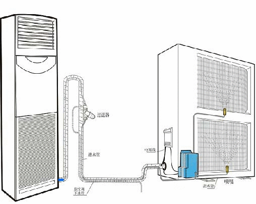

# Smart Conditioning

#### i. Summary
Create a BackEnd and a Web Api for a Smart Device Air Aconditioning

#### ii. Full Spec

##### Intro
One of our clients wants to create a smart air conditioner. They’ve already created the physical
device and luckily for us, it has full HTTP client functionality.
They want us to do a proof of concept of a backend system which integrates with all of their air
conditioning units and provides them with an admin panel to manage their system.
We need to build an HTTP API for the AC units to connect to and a simple web app to serve as
an admin panel for this AC company.

##### Devices API

The devices API should support:

1. Registering a new device: [#1](https://github.com/HernanSaltiveri/SmartConditioning/issues/1)
-  Each device will have a serial number, a registration date, and a firmware
version.

2. Allowing each device to authenticate and send data from its sensors once per minute. 
The sensors on each device provide: [#2](https://github.com/HernanSaltiveri/SmartConditioning/issues/2)
- Temperature in Celsius.
- Air humidity percentage.
- Carbon Monoxide level in the air.
- Device health status. It can be any text, less than 150 characters.

3. Allowing a device to send values for its sensors in bulk, up to 500 values for each of its
sensors instead of just 1. [#3](https://github.com/HernanSaltiveri/SmartConditioning/issues/3)
- If the internet goes out in a home, the AC unit will reconnect when it can to the
wifi and send all the data to our servers that it couldn’t send before. After that, it
will continue sending data normally, once per minute.
- Should our servers go down, the devices may retry a few times. Repeat attempts
will pack values together until our server goes back up

##### Admin Web App

The admin web app should support:
1. Logging in and out, with support for recovering/resetting your password. [#4](https://github.com/HernanSaltiveri/SmartConditioning/issues/4)
2. A mechanism for inviting others to log in with a private invitation link. [#5](https://github.com/HernanSaltiveri/SmartConditioning/issues/5)
3. A way to list all admins and block or re-enabling each of them. [#6](https://github.com/HernanSaltiveri/SmartConditioning/issues/6)
4. A way to list all devices. [#7](https://github.com/HernanSaltiveri/SmartConditioning/issues/7)
5. A way to search for a device given its serial number. [#8](https://github.com/HernanSaltiveri/SmartConditioning/issues/8)
6. A way to see the details of a device, including the values for each of its sensors. [#9](https://github.com/HernanSaltiveri/SmartConditioning/issues/9)
- Values for each sensor, except health status, should be displayed in a graph. [#10](https://github.com/HernanSaltiveri/SmartConditioning/issues/10)
- For each sensor, admins should be allowed to look for its values from “today”,
“this week”, “this month” or “this year. [#11](https://github.com/HernanSaltiveri/SmartConditioning/issues/11)

#### iii. Release Plan

##### v0.1

Issues/Tasks
- [#3 API - Allow Bulk Insert 500 values each sensor](https://github.com/HernanSaltiveri/SmartConditioning/issues/3)
- [#4 Admin - Login Logout](https://github.com/HernanSaltiveri/SmartConditioning/issues/4)
- [#5 Admin - Invite others to connect](https://github.com/HernanSaltiveri/SmartConditioning/issues/5)
- [#6 Admin - List all admin accounts](https://github.com/HernanSaltiveri/SmartConditioning/issues/6)
- [#7 Admin - List All Devices](https://github.com/HernanSaltiveri/SmartConditioning/issues/7)
- [#8 Admin - Search Device by serial number](https://github.com/HernanSaltiveri/SmartConditioning/issues/8)
- [#9 Admin - Details of a Device - Value each sensors](https://github.com/HernanSaltiveri/SmartConditioning/issues/9)

Other Functionality
- WebApi and Admin site on the same project

##### v0.2

Issues/Tasks
- [#1 API - Registering New Device](https://github.com/HernanSaltiveri/SmartConditioning/issues/1)
- [#2 API - Authenticate Send Data From Sensors](https://github.com/HernanSaltiveri/SmartConditioning/issues/2)
- [#10 Admin - Notify even to admins](https://github.com/HernanSaltiveri/SmartConditioning/issues/10)
- [#11 Admin - Notify health status](https://github.com/HernanSaltiveri/SmartConditioning/issues/11)

Other Functionality
- Re Architecture
- Create a separate WebApi project

